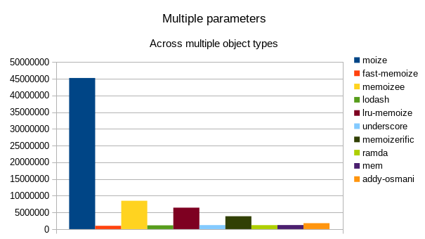

# moize


`moize` is a [consistently blazing fast](#benchmarks) memoization library for JavaScript. It handles multiple parameters (including default values) without any additional configuration, and offers a large number of options to satisfy any number of potential use-cases.

## Table of contents

- [Installation](#installation)
- [Importing](#importing)
- [Usage](#usage)
- [Configuration options](#configuration-options)
  - [equals](#equals)
  - [isDeepEqual](#isdeepequal)
  - [isPromise](#ispromise)
  - [isReact](#isreact)
  - [isSerialized](#isserialized)
  - [matchesKey](#matcheskey)
  - [maxAge](#maxage)
  - [maxArgs](#maxargs)
  - [maxSize](#maxsize)
  - [onCacheAdd](#oncacheadd)
  - [onCacheChange](#oncachechange)
  - [onCacheHit](#oncachehit)
  - [onExpire](#onexpire)
  - [profileName](#profilename)
  - [shouldSerializeFunctions](#serializefunctions)
  - [serializer](#serializer)
  - [transformArgs](#transformargs)
  - [updateExpire](#updateexpire)
- [Usage with shortcut methods](#usage-with-shortcut-methods)
  - [moize.deep](#moizedeep)
  - [moize.maxAge](#moizemaxage)
  - [moize.maxArgs](#moizemaxargs)
  - [moize.maxSize](#moizemaxsize)
  - [moize.promise](#moizepromise)
  - [moize.react](#moizereact)
  - [moize.reactSimple](#moizereactsimple)
  - [moize.serialize](#moizeserialize)
  - [moize.simple](#moizesimple)
- [useMoize hook](#usemoize-hook)
- [Composition](#composition)
- [Introspection](#introspection)
  - [getStats](#getstatsprofilename)
  - [isCollectingStats](#iscollectingstats)
  - [isMoized](#ismoized)
- [Collecting statistics](#collecting-statistics)
- [Direct cache manipulation](#direct-cache-manipulation)
  - [cache](#cache)
  - [cacheSnapshot](#cachesnapshot)
  - [add](#addkey-value)
  - [clear](#clear)
  - [get](#getkey)
  - [getStats](#getstats)
  - [has](#hasargs)
  - [keys](#keys)
  - [remove](#removekey)
  - [update](#updatekey-value)
  - [values](#values)
- [Benchmarks](#benchmarks)
- [Filesize](#filesize)
- [Browser support](#browser-support)
- [Development](#development)

## Installation

```
$ npm i moize --save
```

## Importing

ESM syntax in browsers:

```js
import moize from 'moize';
```

ESM syntax in NodeJS:

```js
import moize from 'moize/mjs';
```

CommonJS:

```js
const moize = require('moize').default;
```

## Usage

```js
import moize from 'moize';

const method = (a, b) => a + b;

const memoized = moize(method);

memoized(2, 4); // 6
memoized(2, 4); // 6, pulled from cache
```

All parameter types are supported, including circular objects, functions, etc. There are also a number of [shortcut methods](#usage-with-shortcut-methods) to memoize for unique use-cases.

## Configuration options

`moize` optionally accepts an object of options as either the second parameter or as the first step in a curried function:

```js
// inline
moize(fn, options);

// curried
moize(options)(fn);
```

The full shape of these options:

```ts
{
  // custom method to compare equality between two objects
  equals: (cachedKeyArg: any, keyArg: any) => boolean,
  // is the cache based on deep equality of keys
  isDeepEqual: boolean,
  // is the result a promise
  isPromise: boolean,
  // is the result a React component
  isReact: boolean,
  // should the parameters be serialized instead of directly referenced
  isSerialized: boolean,
  // amount of time in milliseconds before the cache will expire
  maxAge: number,
  // maximum number of arguments to use as key for caching
  maxArgs: number,
  // maximum size of cache for this method 
  maxSize: number,
  // method fired when a new entry is added to cache
  onCacheAdd: (cache: moize.Cache, options: moize.Options, moized: Function) => void,
  // method fire when either a new entry is added to cache or the LRU ordering of the cache has changed
  onCacheChange: (cache: moize.Cache, options: moize.Options, moized: Function) => void,
  // method fired when an existing entry in cache is used
  onCacheHit: (cache: moize.Cache, options: moize.Options, moized: Function) => void,
  // method to fire when a cache entry expires (in combination with maxAge)
  onExpire: (key: any[]) => void,
  // the unique identifier to give the memoized method when collecting statistics
  profileName: string,
  // should functions be included in the serialization of multiple parameters
  shouldSerializeFunctions: boolean,
  // method to serialize the arguments to build a unique cache key
  serializer: (key: any[]) => string,
  // method to transform the args into a custom format for key storage in cache
  transformArgs: (key: any[]) => any[],
  // should the cache entry's expiration be refreshed when the cache entry is hit (in combination with maxAge)
  updateExpire: boolean
}
```

#### equals

_defaults to [SameValueZero](http://ecma-international.org/ecma-262/7.0/#sec-samevaluezero) equality_

Custom method used to compare equality of keys for cache purposes by comparing each argument.

```js
const fn = ({ foo, bar }) => [foo, bar];

const memoized = moize(fn, {
  equals(cacheKeyArgument, keyArgument) {
    return cacheKeyArgument.foo === 'bar' && keyArgument.foo === 'bar';
  },
});

memoized({ foo: 'bar' });
memoized({ foo: 'bar', bar: 'baz' }); // pulls from cache
```

The `equals` method receives two parameters (cache key arguments) and should return a `boolean`.

**NOTE**: This comparison is used iteratively on each argument, rather than comparing the two keys as a whole. If you want to compare the key as a whole, you should use [`matchesKey`](#matcheskey).

#### isDeepEqual

_defaults to false_

Should deep equality be used to compare cache keys.

```js
const fn = ({ foo, bar }) => [foo, bar];

const memoized = moize(fn, { isDeepEqual: true });

memoized({ foo: 'foo', bar: 'bar' });
memoized({ foo: 'foo', bar: 'bar' }); // pulls from cache
```

This is also available via the shortcut method of [`moize.deep`](#moizedeep)

```js
const memoized = moize.deep(fn);
```

#### isPromise

_defaults to false_

Is the computed value in the function a `Promise`.

```js
const fn = async item => await item;

const memoized = moize(fn, { isPromise: true });
```

This is also available via the shortcut method of [`moize.promise`](#moizepromise).

```js
const memoized =- moize.promise(fn);
```

The `Promise` itself will be stored in cache, so that cached returns will always maintain the `Promise` contract. For common usage reasons, if the `Promise` is rejected, the cache entry will be deleted.

#### isReact

_defaults to false_

Is the function passed a stateless functional `React` component.

```js
const Foo = ({ bar, baz }) => (
  <div>
    {bar}: {baz}
  </div>
);

const MemoizedFoo = moize(Foo, { isReact: true });
```

This is also available via the shortcut method of [`moize.react`](#moizereact).

```js
const MemoizedFoo = moize.react(Foo);
```

The method will do a shallow equal comparison of both `props` and legacy `context` of the component based on strict equality. If you want to do a deep equals comparison, set [`isDeepEqual`](#isdeepequal) to true.

**NOTE**: This will memoize _all_ instances of the component passed. This is different from something like `PureComponent` or `React.memo(Component)`, which memoize on a per-instance basis but also do not take legacy `context` into account.

#### isSerialized

_defaults to false_

Serializes the parameters passed into a string and uses this as the key for cache comparison.

```js
const fn = mutableObject => mutableObject.foo;

const memoized = moize(fn, { isSerialized: true });

const object = { foo: 'foo' };

memoized(object); // 'foo'

object.foo = 'bar';

memoized(object); // 'bar'
```

This is also available via the shortcut method of [`moize.serialize`](#moizeserialize).

```js
const memoized = moize.serialize(fn);
```

If `serialize` is combined with either `maxArgs` or `transformArgs`, the following order is used:

1.  limit by `maxArgs` (if applicable)
1.  transform by `transformArgs` (if applicable)
1.  serialize by `serializer`

**NOTE**: This is much slower than the default key storage, and usually the same requirements can be meet with `isDeepEqual`, so use at your discretion.

#### matchesKey

Custom method used to compare equality of keys for cache purposes by comparing the entire key.

```js
const fn = ({ foo, bar }) => [foo, bar];

const memoized = moize(fn, {
  matchesKey(cacheKey, key) {
    return (
      cacheKey[0].foo === key[0].foo &&
      cacheKey[1].hasOwnProperty('bar') &&
      key[1].hasOwnProperty('bar')
    );
  },
});

memoized({ foo: 'bar' }, { bar: null });
memoized({ foo: 'bar' }, { bar: 'baz' }); // pulls from cache
```

The `matchesKey` method receives two parameters (cache keys) and should return a `boolean`.

**NOTE**: This comparison uses the two keys as a whole, which is usually less performant than the `equals` comparison used iteratively on each argument. Generally speaking you should use the [`equals`](#equals) option for equality comparison.

#### maxAge

The maximum amount of time in milliseconds that you want a computed value to be stored in cache for this method.

```js
const fn = item => item;

const MAX_AGE = 1000 * 60 * 5 // five minutes;

const memoized = moize(fn, { maxAge: MAX_AGE });
```

This is also available via the shortcut method of [`moize.maxAge`](#moizemaxage).

```js
const memoized = moize.maxAge(MAX_AGE)(fn);
```

**TIP**: A common usage of this is in tandom with `isPromise` for AJAX calls, and in that scenario the expected behavior is usually to have the `maxAge` countdown begin upon resolution of the promise. If this is your intended use case, you should also apply the `updateExpire` option.

#### maxArgs

The maximum number of arguments (starting from the first) used in creating the key for the cache.

```js
const fn = (item1, item2, item3) => item1 + item2 + item3;

const memoized = moize(fn, { maxArgs: 2 });

memoize('foo', 'bar', 'baz');
memoize('foo', 'bar', 'quz'); // pulls from cache, as the first two args are the same
```

This is also available via the shortcut method of [`moize.maxArgs`](#moizemaxargs).

```js
const memoized = moize.maxArgs(2)(fn);
```

If `maxArgs` is combined with either `serialize` or `transformArgs`, the following order is used:

1.  limit by `maxArgs`
1.  transform by `transformArgs` (if applicable)
1.  serialize by `serializer` (if applicable)

#### maxSize

_defaults to Infinity_

The maximum number of values you want stored in cache for this method. Clearance of the cache once the `maxSize` is reached is on a [Least Recently Used](https://en.wikipedia.org/wiki/Cache_replacement_policies#Least_Recently_Used_.28LRU.29) basis.

```js
const fn = item => item;

const memoized = moize(fn, { maxSize: 5 });
```

This is also available via the shortcut method of [`moize.maxSize`](#moizemaxsize).

```js
const memoized = moize.maxSize(5)(fn);
```

#### onCacheAdd

Method to fire when an item has been added to cache. Receives the cache, options, and memoized function as a parameters.

```js
const fn = (foo, bar) => [foo, bar];

const moized = moize(fn, {
  onCacheAdd(cache, options, moized) {
    console.log(cache.keys);
  },
});

moized('foo', 'bar'); // [["foo","bar"]]
moized('foo', 'bar');
moized('bar', 'foo'); // [["bar","foo"], ["foo","bar"]]
moized('foo', 'bar');
```

**NOTE**: When combined with `onCacheChange`, this method will always fire first.

#### onCacheChange

Method to fire when an item has been either added to cache, or existing cache was reordered based on a cache hit. Receives the cache, options, and memoized function as a parameters.

```js
const fn = (foo, bar) => [foo, bar];

const moized = moize(fn, {
  onCacheChange(cache, options, moized) {
    console.log(cache.keys);
  },
});

moized('foo', 'bar'); // [["foo","bar"]]
moized('foo', 'bar');
moized('bar', 'foo'); // [["bar","foo"], ["foo","bar"]]
moized('foo', 'bar'); // [["foo","bar"], ["bar","foo"]]
```

**NOTE**: When combined with `onCacheAdd` or `onCacheHit`, this method will always fire last.

#### onCacheHit

Method to fire when an existing cache item is found. Receives the cache, options, and memoized function as a parameters.

```js
const fn = (foo, bar) => [foo, bar];

const moized = moize(fn, {
  onCacheHit(cache, options, moized) {
    console.log(cache.keys);
  },
});

moized('foo', 'bar');
moized('foo', 'bar'); // [["foo","bar"]]
moized('bar', 'foo');
moized('foo', 'bar'); // [["bar","foo"], ["foo","bar"]]
```

**NOTE**: When combined with `onCacheChange`, this method will always fire first.

#### onExpire

A callback that is called when the cached entry expires.

```js
const fn = item => item;

const memoized = moize(fn, {
  maxAge: 10000,
  onExpire(key) {
    console.log(key);
  },
});
```

If you return `false` from this method, it will prevent the key's removal and refresh the expiration in the same vein as `updateExpire` based on `maxAge`:

```js
const fn = item => item;

let expirationAttempts = 0;

const memoized = moize(fn, {
  maxAge: 1000 * 10, // 10 seconds
  onExpire(key) {
    expirationAttempts++;

    return expirationAttempts < 2;
  },
});

memoized('foo'); // will expire key after 30 seconds, or 3 expiration attempts
```

**NOTE**: You must set a [`maxAge`](#maxage) for this option to take effect.

#### profileName

_defaults to function name and file/line location_

Name to use as unique identifier for the function when collecting statistics.

```js
collectStats();

const fn = item => item;

const memoized = moize(fn, { profileName: 'my fancy identity' });
```

**NOTE**: You must be collecting statistics for this option to take effect.

#### shouldSerializeFunctions

_defaults to false_

A [custom replacer](https://developer.mozilla.org/en-US/docs/Web/JavaScript/Reference/Global_Objects/JSON/stringify) is used when serializing to ensure functions are included in the key serialization.

```js
const FunctionalComponent = ({ onClickFoo }) => (
  <button onClick={onClickFoo} type="button">
    Click me!
  </button>
);

const MemoizedFunctionalComponent = moize(FunctionalComponent, {
  isReact: true,
  isSerialized: true,
  shouldSerializeFunctions: true,
});
```

**NOTE**: You must set [`isSerialized`](#isserialized) for this option to take effect.

#### serializer

_defaults to serializeArguments in utils.js_

Method used in place of the internal serializer when serializing the parameters for cache key comparison. The function accepts a single argument, the `Array` of `args`, and must also return an `Array`.

```js
const serializer = args => [JSON.stringify(args[0])];

const memoized = moize(fn, {
  isSerialized: true,
  serializer,
});
```

**NOTE**: You must set [`isSerialized`](#isserialized) for this option to take effect.

#### transformArgs

Transform the arguments passed before it is used as a key. The function accepts a single argument, the `Array` of `args`, and must also return an `Array`.

```js
const fn = (one, two, three) => [two, three];

const ignoreFirstArg = args => args.slice(1);

const moized = moize(fn, { transformArgs: ignoreFirstArg });

moize('foo', 'bar', 'baz');
moize(null, 'bar', 'baz'); // pulled from cache
```

If `transformArgs` is combined with either `maxArgs` or `serialize`, the following order is used:

1.  limit by `maxArgs` (if applicable)
1.  transform by `transformArgs`
1.  serialize by `serializer` (if applicable)

#### updateExpire

When a `maxAge` is set, clear the scheduled expiration of the key when that key is retrieved, setting a new expiration based on the most recent retrieval from cache.

```js
const fn = item => item;

const MAX_AGE = 1000 * 60 * 5; // five minutes

const memoized = moize(fn, {
  maxAge: MAX_AGE,
  updateExpire: true,
});

memoized('foo');

setTimeout(() => {
  memoized('foo'); // hits cache, which updates the expire to be 5 minutes from this run instead of the first
}, 1000 * 60);
```

## Usage with shortcut methods

#### moize.deep

Pre-applies the `isDeepEqual` option.

```js
import moize from 'moize';

const foo = (bar, baz) => `${bar} ${baz}`;

export default moize.deep(foo);
```

#### moize.maxAge

Pre-applies the `maxAge` option as a curriable method.

```js
import moize from 'moize';

const foo = (bar, baz) => `${bar} ${baz}`;

export default moize.maxAge(5000)(foo);
```

#### moize.maxArgs

Pre-applies the `maxArgs` option as a curriable method.

```js
import moize from 'moize';

const foo = (bar, baz) => `${bar} ${baz}`;

export default moize.maxArgs(1)(foo);
```

#### moize.maxSize

Pre-applies the `maxSize` option as a curriable method.

```js
import moize from 'moize';

const foo = (bar, baz) => `${bar} ${baz}`;

export default moize.maxSize(5)(foo);
```

#### moize.promise

Pre-applies the `isPromise` and `updateExpire` options. The `updateExpire` option does nothing if `maxAge` is not also applied, but ensures that the expiration begins at the resolution of the promise rather than the instantiation of it.

```js
import moize from 'moize';

const foo = async (bar, baz) => await someApiCall(bar, baz);

export default moize.promise(foo);
```

**NOTE**: If you do not want the promise to update its expiration when the cache is hit, then you should use the `isPromise` option directly instead.

#### moize.react

Shortcut for memoizing functional components in [React](https://github.com/facebook/react). Key comparisons are based on a shallow equal comparison of both props and context.

```js
import moize from 'moize';

const Foo = ({ bar, baz }) => (
  <div>
    {bar} {baz}
  </div>
);

export default moize.react(Foo);
```

**NOTE**: This method will not operate with components made via the `class` instantiation, as they do not offer the same [referential transparency](https://en.wikipedia.org/wiki/Referential_transparency).

**TIP**: In usages that involve a lot of variety in the parameter changes, this has the potential for excessive memory consumption, as the cache will retain the history of all elements. It is therefore recommended to apply a `maxSize`, or to use the shortcut method [`moize.reactSimple`](#moizereactsimple), which automatically sets the `maxSize` to `1`.

#### moize.reactSimple

Shortcut for memoizing functional components in [React](https://github.com/facebook/react), with the cache size limited to a single entry.

```js
import moize from 'moize';

const Foo = ({ bar, baz }) => (
  <div>
    {bar} {baz}
  </div>
);

export default moize.reactSimple(Foo);
```

**NOTE**: This method will not operate with components made via the `class` instantiation, as they do not offer the same [referential transparency](https://en.wikipedia.org/wiki/Referential_transparency).

#### moize.serialize

Pre-applies the `serialize` option.

```js
import moize from 'moize';

const foo = (bar, baz) => `${bar} ${baz}`;

export default moize.serialize(foo);
```

Please note that if you want to apply `shouldSerializeFunctions` or provide a custom `serializer`, you must do so with additional options:

```js
moize.serialize({ shouldSerializeFunctions: true })(fn);
```

#### moize.simple

Pre-applies the `maxSize` option with `1`.

```js
import moize from 'moize';

const foo = (bar, baz) => `${bar} ${baz}`;

export default moize.simple(foo);
```

## useMoize hook

If you are using React 16.8+ and are using hooks, you can easily create a custom `useMoize` hook for your project:

```js
import { useRef } from 'react';

export function useMoize(fn, args, options) {
  const moizedFn = useRef(moize(fn, options));

  return moizedFn.current(...args);
}
```

Which can then be used as such:

```js
import React from 'react';

import { useMoize } from './moize-hooks';

function MyComponent({ first, second, object }) {
  // standard usage
  const sum = useMoize((a, b) => a + b, [first, second]);
  // with options
  const deepSum = useMoize(obj => obj.a + obj.b, [object], {
    isDeepEqual: true,
  });

  return `Sum of ${first} and ${second} is ${sum}. Sum of ${object.a} and ${
    object.b
  } is ${deepSum}.`;
}
```

Naturally you can tweak as needed for your project (default options, option-specific hooks, etc).

**NOTE**: This is very similar to [`useCallback`](https://reactjs.org/docs/hooks-reference.html#usecallback) built-in hook, with two main differences:

- There is a third parameter passed (the [`options`](#configuration-options) passed to `moize`)
- The second argument array is the list of arguments passed to the memoized function

In both `useCallback` and `useMemo`, the array is a list of _dependencies_ which determine whether the funciton is called. These can be different than the arguments, although in general practice they are equivalent. The decision to use them directly was both for this common use-case reasons, but also because the implementation complexity would have increased substantially if not.

## Composition

Starting with version `2.3.0`, you can compose `moize` methods. This will create a new memoized method with the original function that shallowly merges the options of the two setups. Example:

```js
import moize from 'moize';

const Foo = props => <div {...props} />;

// memoizing with react, as since 2.0.0
const MemoizedFoo = moize.react(Foo);

// creating a separately-memoized method that has maxSize of 5
const LastFiveFoo = moize.maxSize(5)(MemoizedFoo);
```

You can also create an options-first curriable version of `moize` if you only pass the options:

```js
import moize from 'moize';

// creates a function that will memoize what is passed
const limitedSerializedMoize = moize({
  maxSize: 5,
  serialize: true,
});

const getWord = bird => `${bird} is the word`;

const moizedFoo = limitedSerializedMoize(getWord);
```

You can also combine all of these options with `moize.compose` to create `moize` wrappers with pre-defined options.

```js
import moize from 'moize';

// creates a moizer that will have the options of
// {isReact: true, maxAge: 5000, maxSize: 5}
const superLimitedReactMoize = moize.compose(
  moize.react,
  moize.maxSize(5),
  moize.maxAge(5000),
);
```

## Collecting statistics

As-of version 5, you can collect statistics of moize to determine if your cached methods are effective.

```js
import moize, { collectStats } from 'moize';

collectStats();

const fn = (foo, bar) => [foo, bar];

const moized = moize(fn);

moized('foo', 'bar');
moized('foo', 'bar');

moized.getStats(); // {"calls": 2, "hits": 1, "usage": "50%"}
```

**NOTE**: It is recommended not to activate this in production, as it will have a performance decrease.

## Introspection

#### collectStats

Start collecting statistics on `moize`d functions. The same function as if you were to import `collectStats` directly and call it, just placed on the default object as a convenience.

```js
moize.collectStats();
```

#### getStats([profileName])

Get the statistics for a specific function, or globally.

```js
collectStats();

const fn = (foo, bar) => [foo, bar];

const moized = moize(fn);

const otherFn = bar => bar.slice(0, 1);

const otherMoized = moize(otherFn, { profileName: 'otherMoized' });

moized('foo', 'bar');
moized('foo', 'bar');

moized.getStats(); // {"calls": 2, "hits": 1, "usage": "50%"}

otherMoized(['baz']);

moize.getStats('otherMoized'); // {"calls": 1, "hits": 0, "usage": "0%"}

moize.getStats();
/*
 {
   "calls": 3,
   "hits": 1,
   "profiles": {
     "fn at Object..src/utils.js (http://localhost:3000/app.js:153:68)": {
       "calls": 2,
       "hits": 1,
       "usage": "50%"
     },
     "otherMoized": {
       "calls": 1,
       "hits": 0,
       "usage": "0%"
     }
   },
   "usage": "33.3333%"
 }
 */
```

#### isCollectingStats

Are statistics being collected on memoization usage.

```js
moize.isCollectingStats(); // false

collectStats();

moize.isCollectingStats(); // true
```

#### isMoized

Is the function passed a moized function.

```js
const fn = () => {};
const moizedFn = moize(fn);

moize.isMoized(fn); // false
moize.isMoized(moizedFn); // true
```

## Direct cache manipulation

The cache is available on the `moize`d function as a property, and while it is not recommended to modify it directly, that option is available for edge cases.

#### cache

The shape of the `cache` is as follows:

```js
{
  keys: Array<Array<any>>,
  size: number,
  values: Array<any>
}
```

Regardless of how the key is transformed, it is always stored as an array (if the value returned is not an array, it is coalesced to one).

**NOTE**: The order of `keys` and `values` should always align, so be aware when manually manipulating the cache that you need to manually keep in sync any changes to those arrays.

#### cacheSnapshot

The `cache` is mutated internally for performance reasons, so logging out the cache at a specific step in the workflow may not give you the information you need. As such, to help with debugging you can request the `cacheSnapshot`, which has the same shape as the `cache` but is a shallow clone of each property for persistence.

There are also convenience methods provided on the `moize`d function which allow for programmatic manipulation of the cache.

#### add(key, value)

This will manually add the _value_ at _key_ in cache if _key_ does not already exist. _key_ should be an `Array` of values, meant to reflect the arguments passed to the method.

```js
// single parameter is straightforward
const memoized = moize(item => item);

memoized.add(['foo'], 'bar');

// pulls from cache
memoized('foo');
```

**NOTE**: This will only add `key`s that do not exist in the cache, and will do nothing if the `key` already exists. If you want to update keys that already exist, use [`update`](#updatekey-value).

#### clear()

This will clear all values in the cache, resetting it to an empty state.

```js
const memoized = moize(item => item);

memoized.clear();
```

#### get(key)

Returns the value in cache if the key matches, else returns `undefined`. _key_ should be an `Array` of values, meant to reflect the arguments passed to the method.

```js
const memoized = moize((first, second) => [first, second]);

memoized('foo', 'bar');

console.log(memoized.get(['foo', 'bar'])); // ["foo","bar"]
console.log(memoized.get(['bar', 'baz'])); // undefined
```

#### getStats()

Returns the statistics for the function.

```js
collectStats();

const memoized = moize((first, second) => [first, second]);

memoized('foo', 'bar');
memoized('foo', 'bar');

console.log(memoized.getStats()); // {"calls": 2, "hits": 1, "usage": "50%"}
```

**NOTE**: You must be collecting statistics for this to be populated.

#### has(key)

This will return `true` if a cache entry exists for the _key_ passed, else will return `false`. _key_ should be an `Array` of values, meant to reflect the arguments passed to the method.

```js
const memoized = moize((first, second) => [first, second]);

memoized('foo', 'bar');

console.log(memoized.has(['foo', 'bar'])); // true
console.log(memoized.has(['bar', 'baz'])); // false
```

#### keys()

This will return a list of the current keys in `cache`.

```js
const memoized = moize(item => item);

const foo = 'foo';

memoized(foo);

const bar = { baz: 'baz' };

memoized(bar);

const keys = memoized.keys(); // [['foo'], [{baz: 'baz'}]]
```

#### remove(key)

This will remove the provided _key_ from cache. _key_ should be an `Array` of values, meant to reflect the arguments passed to the method.

```js
const memoized = moize(item => item);

const foo = { bar: 'baz' };

memoized(foo);

memoized.remove([foo]);

// will re-execute, as it is no longer in cache
memoized(foo);
```

**NOTE**: This will only remove `key`s that exist in the cache, and will do nothing if the `key` does not exist.

#### update(key, value)

This will manually update the _value_ at _key_ in cache if _key_ exists. _key_ should be an `Array` of values, meant to reflect the arguments passed to the method.

```js
// single parameter is straightforward
const memoized = moize(item => item);

memoized.add(['foo'], 'bar');

// pulls from cache
memoized('foo');
```

**NOTE**: This will only update `key`s that exist in the cache, and will do nothing if the `key` does not exist. If you want to add keys that do not already exist, use [`add`](#addkey-value).

#### values()

This will return a list of the current values in `cache`.

```js
const memoized = moize(item => ({ item }));

const foo = 'foo';

memoized(foo);

const bar = { baz: 'baz' };

memoized(bar);

const values = memoized.values(); // [{item: 'foo'}, {item: {baz: 'baz'}}]
```

## Benchmarks

All values provided are the number of operations per second calculated by the [Benchmark suite](https://benchmarkjs.com/), where a higher value is better. Each benchmark was performed using the default configuration of the library, with a fibonacci calculation based on a starting parameter of `35`, using single and multiple parameters with different object types. The results were averaged to determine overall speed across possible usage.

**NOTE**: `lodash`, `ramda`, and `underscore` do not support mulitple-parameter memoization without use of a `resolver` function. For consistency in comparison, each use the same `resolver` that returns the result of `JSON.stringify` on the arguments.

| Name         | Overall (average) | Single (average) | Multiple (average) | single primitive | single array   | single object  | multiple primitive | multiple array | multiple object |
| ------------ | ----------------- | ---------------- | ------------------ | ---------------- | -------------- | -------------- | ------------------ | -------------- | --------------- |
| **moize**    | **54,174,185**    | **63,114,600**   | **45,233,770**     | **71,543,826**   | **58,764,177** | **59,035,797** | **59,035,797**     | **44,978,364** | **45,017,968**  |
| fast-memoize | 37,591,552        | 74,183,948       | 999,155            | 219,504,451      | 1,582,247      | 1,465,147      | 1,210,230          | 972,741        | 814,496         |
| memoizee     | 10,953,206        | 13,429,670       | 8,476,743          | 16,114,807       | 12,226,505     | 11,947,699     | 10,238,867         | 7,615,024      | 7,576,339       |
| lodash       | 7,760,981         | 14,392,042       | 1,129,921          | 27,195,493       | 8,059,276      | 7,921,357      | 1,396,024          | 1,106,101      | 887,640         |
| lru-memoize  | 6,818,881         | 7,216,322        | 6,421,440          | 7,761,636        | 7,016,605      | 6,870,726      | 6,472,962          | 6,323,183      | 6,468,176       |
| underscore   | 5,140,473         | 9,073,217        | 1,207,730          | 22,750,266       | 2,419,458      | 2,049,928      | 1,490,129          | 1,181,751      | 951,310         |
| memoizerific | 4,320,437         | 4,784,512        | 3,856,362          | 5,608,168        | 4,374,440      | 4,370,928      | 4,568,332          | 3,455,887      | 3,544,867       |
| ramda        | 3,831,370         | 6,470,175        | 1,192,564          | 15,012,589       | 2,380,971      | 2,016,966      | 1,470,378          | 1,161,390      | 945,926         |
| mem          | 2,679,860         | 4,138,450        | 1,221,271          | 9,431,005        | 1,554,267      | 1,430,078      | 1,537,629          | 1,197,269      | 928,915         |
| addy-osmani  | 2,504,948         | 3,224,227        | 1,785,669          | 6,430,710        | 1,560,466      | 1,681,506      | 3,215,093          | 1,184,364      | 957,550         |




## Filesize

`moize` is fairly small (about 4.5KB when minified and gzipped), however it provides a large number of configuration options to satisfy a number of edge cases. If filesize is a concern, you may consider using [`micro-memoize`](https://github.com/planttheidea/micro-memoize). This is the memoization library that powers `moize` under-the-hood, and will handle most common use cases at 1/4 the size of `moize`.

## Browser support

- Chrome (all versions)
- Firefox (all versions)
- Edge (all versions)
- Opera 15+
- IE 9+
- Safari 6+
- iOS 8+
- Android 4+

## Development

Standard stuff, clone the repo and `npm install` dependencies. The npm scripts available:

- `benchmark` => run the benchmark suite pitting `moize` against other libraries in common use-cases
- `benchmark:alternative` => run the benchmark suite for alternative forms of caching in `moize`
- `build` => run rollup to build the distributed files in `dist`
- `clean` => run `clean:lib`, `clean:es`, `clean:dist`, and `clean:docs`
- `clean:dist` => run `rimraf` on the `dist` folder
- `clean:docs` => run `rimraf` on the `docs` folder
- `clean:es` => run `rimraf` on the `es` folder
- `clean:lib` => run `rimraf` on the `lib` folder
- `dev` => run webpack dev server to run example app (playground!)
- `dist` => runs `clean:dist` and `build`
- `docs` => runs `clean:docs` and builds the docs via `jsdoc`
- `flow` => runs `flow check` on the files in `src`
- `lint` => runs ESLint against all files in the `src` folder
- `lint:fix` => runs `lint``, fixing any errors if possible
- `postpublish` => runs `docs`
- `prepublish` => runs `compile-for-publish`
- `prepublish:compile` => run `lint`, `flow`, `test:coverage`, `transpile:lib`, `transpile:es`, and `dist`
- `test` => run AVA test functions with `NODE_ENV=test`
- `test:coverage` => run `test` but with `nyc` for coverage checker
- `test:watch` => run `test`, but with persistent watcher
- `transpile:es` => run babel against all files in `src` to create files in `es`, preserving ES2015 modules (for [`pkg.module`](https://github.com/rollup/rollup/wiki/pkg.module))
- `transpile:lib` => run babel against all files in `src` to create files in `lib`
