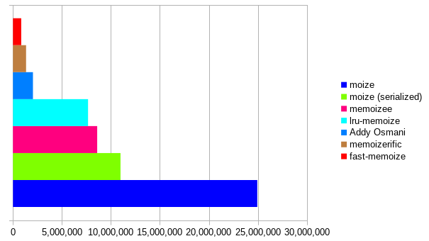
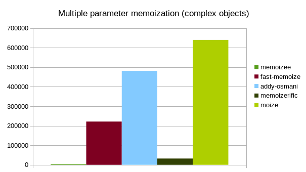

# moize


`moize` is a [blazing fast](#benchmarks) memoization library for JavaScript. It handles multiple arguments out of the box (including default values), and offers options to help satisfy a number of implementation-specific needs. It has no dependencies, and is less than 3kb when minified and gzipped.

### Table of contents
* [Upgrade notification](#upgrade-notification)
* [Installation](#installation)
* [Usage](#usage)
* [Usage with functional React components](#usage-with-functional-react-components)
* [Advanced usage](#advanced-usage)
* [Direct cache manipulation](#direct-cache-manipulation)
* [Benchmarks](#benchmarks)
* [Browser support](#browser-support)
* [Development](#development)

### Upgrade notification

Users of `moize` 1.x.x will have some small but breaking changes, especially related to its use with functional components. Please see the [changelog](CHANGELOG.md) for more details about how to manage the upgrade.

### Installation

```
$ npm i moize --save
```

### Usage

```javascript
import moize from 'moize';

const method = (a, b) => {
  return a + b;
};

const memoized = moize(method);

memoized(2, 4); // 6
memoized(2, 4); // 6, pulled from cache
```

All parameter types are supported, including circular objects, functions, etc. You can even memoize functional `React` components based on their `props` + `context` combination!

### Usage with functional React components

Now in 2.x.x of `moize` you have a quick shortcut for memoizing functional components in [React](https://github.com/facebook/react):

```javascript
import moize from 'moize';

const Foo = ({bar, baz}) => {
  return (
    <div>
      {bar} {baz}
    </div>
  );
};

export default moize.react(Foo);
```

`moize.react` will auto-apply the `serialize` and `serializeFunctions` options, and set `maxArgs` equal to `2`, which allows for a value equality comparison of `props` and `context`. You can still pass additional options in the same way you pass them in the default `moize` method. Please note this will not operate with components made via the `class` instantiation.

### Advanced usage

`moize` optionally accepts an object of options as the second parameter. The full shape of these options:

```javascript
{
  cache: Map|Object, // custom cache implementation
  isPromise: boolean, // is the result a promise
  maxAge: number, // amount of time in milliseconds before the cache will expire
  maxArgs: number, // maximum number of arguments to use as key for caching
  maxSize: number, // maximum size of cache for this method
  serialize: boolean, // should the parameters be serialized instead of directly referenced
  serializeFunctions: boolean, // should functions be included in the serialization of multiple parameters
  serializer: Function // method to serialize the arguments to build a unique cache key
}
```

**cache** *defaults to new Map()*

The default cache implementation is build for speed in its purpose, however if you would like then you can pass in a custom cache implementation. The only requirements for the cache implementation is that it matches the relevant `Map` API methods:
* clear
* delete
* get
* has
* set

```javascript
const cache = {
  clear() {
    Object.keys(this).forEach((key) => {
      if (typeof this[key] !== 'function') {
        this.delete(key);
      }
    });
  },
  delete(key) {
    delete this[key];
  },
  get(key) {
    return this[key];
  },
  has(key) {
    return this.hasOwnProperty[key];
  },
  set(key, value) {
    this[key] = value;

    return this;
  }
};
const fn = (item) => {
  return item;
};

const memoized = moize(fn, {
  cache
});
```

**isPromise** *defaults to false*

Is the computed value in the function a `Promise`, and should we cache the resolved value from that `Promise`.

```javascript
const fn = async (item) => {
  return await item;
};

const memoized = moize(fn, {
  isPromise: true
});
```

**maxAge** *defaults to Infinity*

The maximum amount of time in milliseconds that you want a computed value to be stored in cache for this method.

```javascript
const fn = (item) => {
  return item;
};

const memoized = moize(fn, {
  maxAge: 1000 * 60 * 5 // five minutes
});
```

**maxArgs** *defaults to the length of arguments passed to the method*

The maximum number of arguments used in creating the key for the cache.

```javascript
const fn = (item1, item2, item3) => {
  return item1 + item2 + item3;
};

const memoized = moize(fn, {
  maxArgs: 2
});
```

**maxSize** *defaults to Infinity*

The maximum size of the cache you want stored in cache for this method. Clearance of the cache once the `maxSize` is reached is on a [Least Recently Used](https://en.wikipedia.org/wiki/Cache_replacement_policies#Least_Recently_Used_.28LRU.29) basis.

```javascript
const fn = (item) => {
  return item;
};

const memoized = moize(fn, {
  maxSize: 5
});
```

**serialize** *defaults to false*

In `moize` 1.x.x, parameter serialization was used, whereas in 2.x.x and beyond we use strict equality to compare parameters. While this is both faster and more accurate, there may be scenarios where you want to serialize the parameters instead (for value equality comparison in situations where you are using mutated objects, for example). Simply pass the `serialize` parameter as `true` and you will use the performant serializer from 1.x.x.

```javascript
const fn = (mutableObject) => {
  return mutableObject.foo;
};

const memoized = moize(fn, {
  serialize: true
});

const object = {
  foo: 'foo'
};

memoized(object); // 'foo'

object.foo = 'bar';

memoized(object); // 'bar'
```

**serializeFunctions** *defaults to false*

By setting this option to `true`, a [custom replacer](https://developer.mozilla.org/en-US/docs/Web/JavaScript/Reference/Global_Objects/JSON/stringify) will be used to ensure functions are included in the key serialization. This is especially beneficial when caching functional `React` components, as interactivity functions as part of props will now be included in the unique key structure (in fact, this is exactly how `moize.react` works!). Please note that this will decrease performance of this specific function between 10-25% depending on environment.

```javascript
const FunctionalComponent = ({onClickFoo}) => {
  return (
    <button
      onClick={onClickFoo}
      type="button"
    >
      Click me!
    </button>
  )
};

const MemoizedFunctionalComponent = moize(FunctionalComponent, {
  serializeFunctions: true
});
```

Please note that you must also set `serialize` to true for this setting to take effect.

**serializer** *defaults to serializeArguments in utils.js*

The default seralizer method is highly performant, and covers a number of edge cases (recursive objects, for example), however if you want to provide a custom one you may. The value returned from the function must be a valid value of keys for a `Map`.

```javascript
const serializer = (args) => {
  return JSON.stringify(args[0]);
};

const memoized = moize(fn, {
  serializer
});
```

Please note that you must also set `serialize` to true for this setting to take effect.

### Direct cache manipulation

There are a couple of methods provided on the memoized function which allow for programmatic manipulation of the cache:

**add(key, value)**

This will manually add the *value* at *key* in cache if *key* does not already exist.

```javascript
// single parameter is straightforward
const memoized = moize((item) => {
  return item;
});

memoized.add('foo', 'bar');

// for multiple parameters, pass an array of arguments as the key
const memoized = moize((item1, item2) => {
  return item1 + item2;
});

memoized.add([1, 2], 3);
```

**clear()**

This will clear all values in the cache, resetting it to a default state.

```javascript
const memoized = moize((item) => {
  return item;
});

memoized.clear();
```

**delete(key)**

This will delete the provided key from cache.

```javascript
// if single parameter, delete with the object itself
const memoized = moize((item) => {
  return item;
});

const foo = {
  bar: 'baz'
};

memoized(foo);

memoized.delete(foo);

// if multi parameter, delete with the same arguments you passed
const memoized = moize((item1, item2) => {
  return item1 + item2;
});

const foo = 1;
const bar = 2;

memoized(foo, bar);

memoized.delete(foo, bar);
```

**keys()**

This will return a list of the current keys in cache.

```javascript
const memoized = moize((item) => {
  return item;
});

const foo = 'foo';

memoized(foo);

const bar = {
  baz: 'baz'
};

memoized(bar);

const keys = memoized.keys(); // ['foo', {baz: 'baz'}]
```

**values()**

This will return a list of the current values in cache.

```javascript
const memoized = moize((item) => {
  return {
    item
  };
});

const foo = 'foo';

memoized(foo);

const bar = {
  baz: 'baz'
};

memoized(bar);

const values = memoized.values(); // [{item: 'foo'}, {item: {baz: 'baz'}}]
```

### Benchmarks

All values provided are the number of operations per second (ops/sec) calculated by the [Benchmark suite](https://benchmarkjs.com/). Note that `underscore`, `lodash`, and `ramda` do not support mulitple-parameter memoization, so they are not included in those benchmarks. Each benchmark was performed using the default configuration of the library, with a fibonacci calculation based on a starting parameter of 35, and in the case of multiple parameters a second parameter (`boolean` for primitives, `object` for complex objects) was used.


| underscore | lodash    | ramda     | memoizee   | fast-memoize | addy-osmani | memoizerific | moize      |
|------------|-----------|-----------|------------|--------------|-------------|--------------|------------|
| 9,393,399  | 9,679,995 | 1,102,656 | 11,651,361 | 31,085,245   | 3,656,676   | 2,184,221    | 47,089,212 |



| memoizee  | fast-memoize | addy-osmani | memoizerific | moize     |
|-----------|--------------|-------------|--------------|-----------|
| 8,144,578 | 1,256,879    | 1,788,762   | 1,433,723    | 9,762,395 |



| memoizee  | fast-memoize | addy-osmani | memoizerific | moize     |
|-----------|--------------|-------------|--------------|-----------|
| 8,208,516 | 1,019,949    | 922,261     | 1,419,771    | 9,741,543 |

### Browser support

* Chrome (all versions)
* Firefox (all versions)
* Opera 15+
* Edge (all versions)
* IE 9+
* Safari 6+

Theoretically the support should go back even farther, these are just the environments that I have tested.

### Development

Standard stuff, clone the repo and `npm install` dependencies. The npm scripts available:
* `build` => run webpack to build development `dist` file with NODE_ENV=development
* `build:minifed` => run webpack to build production `dist` file with NODE_ENV=production
* `dev` => run webpack dev server to run example app (playground!)
* `dist` => runs `build` and `build-minified`
* `docs` => builds the docs via `jsdoc`
* `lint` => run ESLint against all files in the `src` folder
* `prepublish` => runs `compile-for-publish`
* `prepublish:compile` => run `lint`, `test`, `transpile`, `dist`
* `test` => run AVA test functions with `NODE_ENV=test`
* `test:coverage` => run `test` but with `nyc` for coverage checker
* `test:watch` => run `test`, but with persistent watcher
* `transpile` => run babel against all files in `src` to create files in `lib`
